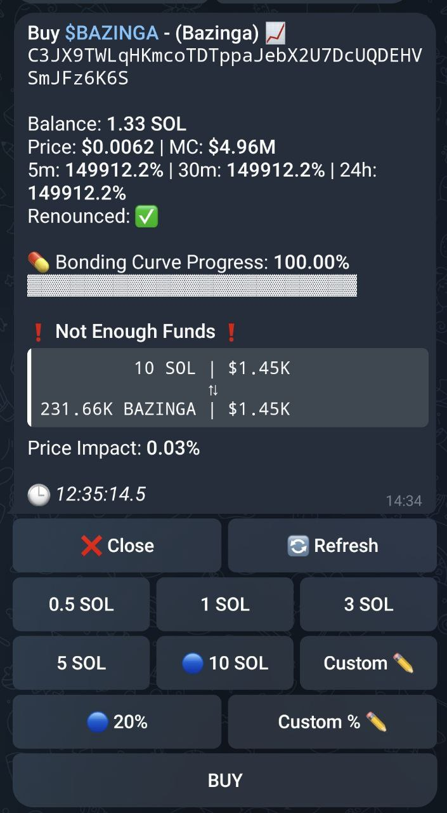

# 🛒 Buy a Token

<figure><figcaption>
A Buy Menu for the $BAZINGA Token
</figcaption></figure>

### Getting Started:

1. **Paste the Mint Address:** Simply paste the token mint address you wish to buy. No need to tap the "Buy" button. The bot will automatically recognize the mint and open the buy menu.
2. **Token Menu:** You'll be presented with a menu containing the token symbol, current price, and market cap. You can also view the 5-minute, 30-minute, and 24-hour price changes. If the token is a Pump.fun token, the bonding curve progress will also be displayed.

### Configuring Your Buy Order:

* **Amount to Buy (SOL):** Select from the preset SOL amounts or...
* **Select a Custom Amount:** You can choose a custom amount by tapping "Custom ✏️" and entering the desired SOL amount.
* **Slippage:**
  * **Definition:** Slippage is the maximum price increase you're willing to accept for your buy order. Higher slippage means a faster trade but potentially a worse price.
  * **Settings:**
    * Select from your preset slippage percentage or choose "Custom % ✏️" to enter your preferred percentage.
    * **Example:** If you set a 5% slippage and wish to buy 1 SOL worth of a token, the bot will execute the order if the price doesn't rise by more than 5%.

### Executing Your Buy Order:

* **Confirm and Buy:**
  * If you enabled Confirm Trades in your settings, you will be asked to confirm your order.
  * Otherwise, the bot will automatically try to execute your buy order.
* **Transaction Details:** After sending your order, the bot will display a message with the transaction details and a link to Solscan for monitoring.

**Remember:** The right balance between price and speed depends on your trading strategy. Adjust your buy amounts and slippage accordingly!
