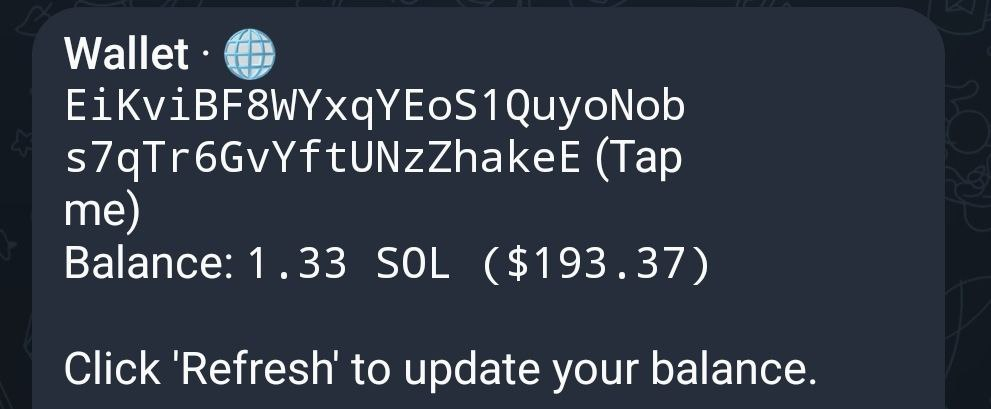

# ⚡ Deposit SOL

<figure><figcaption>
Your wallet as seen in the /start Menu
</figcaption></figure>

It's easy to deposit SOL into your TurboTendies wallet! Here's how:

1. **Copy Your Wallet Address:** Find your wallet address in the TurboTendies bot.
2. **Go to Your Solana Wallet:** Open your preferred Solana wallet (like Phantom, Solflare, or Backpack).
3. **Send SOL:**
   * Send SOL to the copied wallet.
   * Confirm the transaction in your wallet.
4. **Watch Your Balance Update:** Once your SOL deposit is confirmed on the Solana network, you can press the **Refresh 🔄** button to see your balance update.
