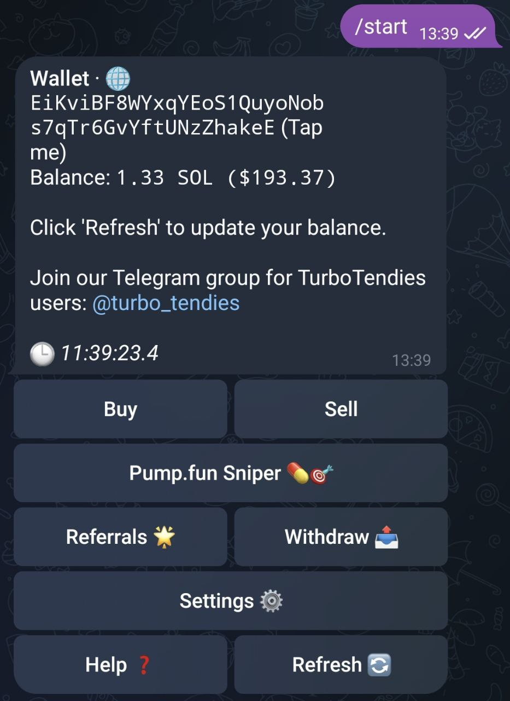

# 📪 Initialization

**Get Started with /start**

<figure><figcaption>
/start Menu
</figcaption></figure>

1. **Launch the bot:** Send `/start` to the TurboTendies bot in Telegram.
2. **Link your wallet:** The bot will automatically generate a new wallet for you or display the public key of your existing wallet.
3.  **Explore the menu:** You'll be presented with a menu featuring key trading functions:

    * **Buy:** Purchase tokens from various exchanges.
    * **Sell:** Sell tokens you own.
    * **Pump.fun Sniper:** Automatically purchase new Pump.fun tokens as they are minted.
    * **Referrals:** Invite friends to earn rewards for their trades.
    * **Withdraw:** Transfer SOL or SPL tokens to any Solana wallet.
    * **Settings:** Customize your trading preferences.
    * **Help:** Get detailed information about the bot's features.
    * **Refresh:** Update your SOL balance and token holdings.

