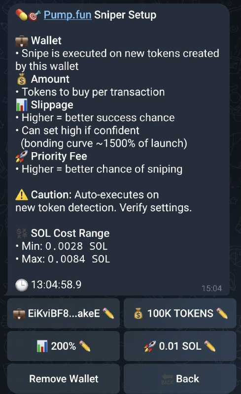

# 🎯 Pump.fun Sniper

This section lets you set up automatic sniping for new tokens minted by specific wallets. Configure your preferences and TurboTendies will automatically buy tokens for you when a new mint is detected.

**How to set up a sniping setup:**

1. **Add a wallet:**

* Go to the **Pump.fun Sniper Menu** and click **➕ Add**.
* You will be prompted to enter the wallet's public key.

<figure><figcaption>
Main Sniping Menu with a List of All Wallets
</figcaption></figure>

2. **Configure your settings:**

* **Wallet:** The wallet you want to snipe tokens from.
* **Amount:** How many tokens you want to purchase per transaction.
* **Slippage:** The maximum price difference you're willing to accept. Higher slippage gives the bot a better chance of sniping the token, but it may also mean a higher price.
* **Priority Fee:** Higher priority fees increase your chances of sniping by making your transaction faster.

<figure><figcaption>
A Setup for a Certain Wallet
</figcaption></figure>

3. **Notifications and Confirmation:**

* You will receive a notification whenever a snipe order is placed.
* The notification will include:
  * The transaction details (including the transaction ID, which you can use to track the transaction on a blockchain explorer).
  * The SOL cost range of the purchase.
  * The slippage used.
  * The response time (the time it took the bot to detect the new token and place the order).
* Once the transaction is confirmed, you will receive another notification with the final results.

<figure><figcaption>
A Confirmation of a Snipe Happening
</figcaption></figure>
