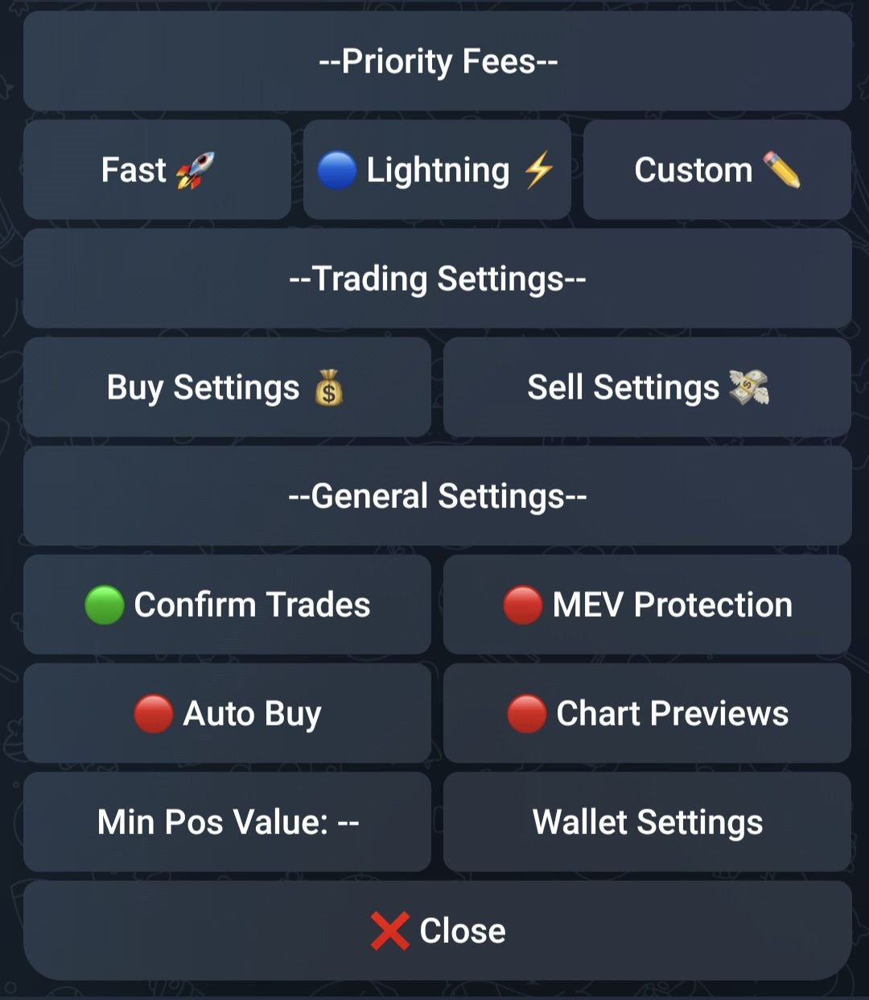

# ⚙️ Settings

<figure><figcaption>
Settings panel in the bot
</figcaption></figure>

TurboTendies allows you to tailor your trading experience with our intuitive settings menu.

Find information about each setting in the following sub-pages.

**General Settings 💡**

* **Confirm Trades 🔔**: Enable confirmation prompts for extra security before each trade.
* **MEV Protection 🐢**: Reduce the risk of front-running bots with optional MEV protection.
* **Min Pos Value**: Set the minimum USD value for token positions to appear in the sell menu.
* **Chart Previews 📈**: Enable/disable previews for links with trading chart data.
* **Wallet Settings 🔐**: Import a new wallet using its secret key, or export your current wallet's secret key for safekeeping.

**Auto Buy 🤖**

Enable automatic token purchases upon sending a token mint as a message. Use with caution! Autobuy executes trades automatically based on your predefined settings.

\
